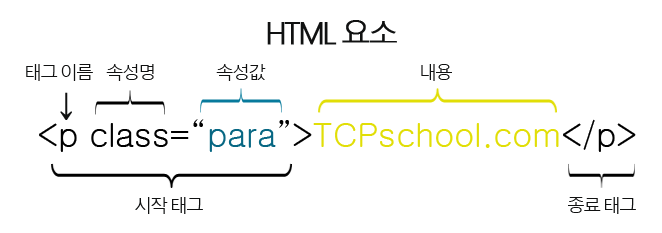

## HTML 태그

- <태그이름> // 시작 태그
- </태그이름> // 종료 태그
- 그러나, img, br, hr 등과 같이 시작 태그만을 가지는 태그를 빈 태그 (empty tag)라고 함

### 제목 (heading)

h1 ~ h6

### 단락 (paragraph)
p

## HTML 버전

- HTML 1.0 (1991) - Tim Berners-Lee가 발표한 최초의 HTML
- HTML 2.0 (1995) - 국제 표준으로 제정된 최초의 HTML
- HTML 3.2 (1997) - W3C (World Wide Webb Consortium) 에 의해 제정된 최초의 HTML
- HTML 4.01 (1999) - <!DOCTYPE HTML PUBLIC "-//W3C//DTD HTML 4.01//EN"
"[http://www.w3.org/TR/html4/strict.dtd](http://www.w3.org/TR/html4/strict.dtd)">
- XHTML 1.0 (2000) - <!DOCTYPE html PUBLIC "-//W3C//DTD XHTML 1.0 Strict//EN"
"[http://www.w3.org/TR/xhtml1/DTD/xhtml1-strict.dtd](http://www.w3.org/TR/xhtml1/DTD/xhtml1-strict.dtd)">
- HTML 5 (2014) - <!DOCTYPE html>

W3C (World Wide Web Consortium)에서 관리중인 웹 표준

- HTML, CSS, DOM, SVG, XHTML, XML

## HTML 기본 구조

```html
<!DOCTYPE html> //현재 문서가 HTML5임을 명시
<html> //HTML 문서의 루트(root) 요소를 정의
	<head> //HTML 문서의 메타데이터(metadata)를 정의
    - 메타데이터(metadata)란 HTML 문서에 대한 정보(data)로 웹 브라우저에는 직접적으로 표현되지 않는 정보를 의미
    - 이러한 메타데이터는 <title>, <style>, <meta>, <link>, <script>, <base>태그 등을 이용하여 표현
		<title>HTML 문서의 제목입니다.</title> //HTML 문서의 제목(title)을 정의
		- 웹 브라우저의 툴바(toolbar)에 표시
		- 웹 브라우저의 즐겨찾기(favorites)에 추가할 때 즐겨찾기의 제목이 됨
		- 검색 엔진의 결과 페이지에 제목으로 표시
	</head>

	<body> //웹 브라우저를 통해 보이는 내용(content)
		<h1>제목 크기 1입니다.</h1>
		<h2>제목 크기 2입니다.</h2>
		<p>이 부분은 단락입니다.</p>
	</body>
</html>
```

## HTML 요소 구조

HTML 요소(element)는 여러 속성을 가질 수 있으며, 이러한 속성(attribute)은 해당 요소에 대한 추가적인 정보를 제공

또한, HTML 요소는 시작 태그로 시작해서 종료 태그로 끝남



속성은 HTML 요소 중에서도 언제나 시작 태그 내에서만 정의되며, 속성 이름과 속성값(value)으로 표현됨

## 문법

<태그이름 속성이름=”속성값”>

> **속성 이름은 언제나 소문자!**

HTML5 표준에서는 속성 이름에 대소문자 구분 X

But, W3C에서는 속성 이름 사용 시 되도록 소문자 권장

또한, XHTML에서는 속성 이름을 소문자로 사용하도록 엄격히 규정

> **속성값은 언제나 따옴표로 감싸자!**

HTML5 표쥰에서는 속성값에 따옴표 사용을 강제 X

But, 속성값을 따옴표로 감싸지 않으면 다음과 같은 예상치 못한 오류가 발생

```html
<!DOCTYPE html>
<html lang="ko">

<head>
	<meta charset="UTF-8">
	<title>HTML Tag Structure</title>
</head>

<body>

	<h1>속성값의 따옴표</h1>
	<p>속성값에 정말로 따옴표가 필요할까요?</p>
	<br>
	
	
</body>

</html>
```

위 예제와 같이 속성값에 띄어쓰기가 들어가게 되면, 반드시 따옴표를 사용해야 정확한 값을 저장할 수 있음

속성값을 감쌀 때는 보통 큰따옴표(””)가 사용되며, 작은따옴표(’’)도 사용할 수 있음